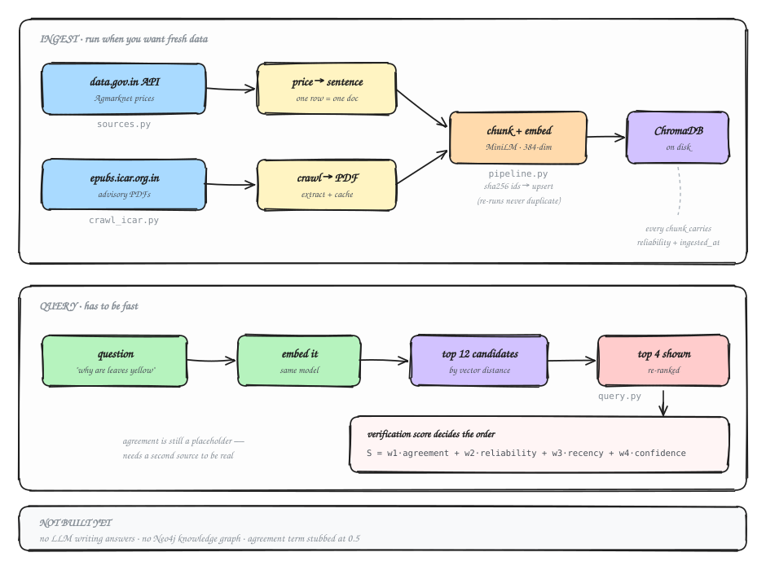

# agri-kg-rag

Data layer for an agricultural advisory system. It pulls crop prices and ICAR
advisory PDFs, embeds them into a vector store, and answers a question by
returning the most relevant chunks, ordered by a trust score rather than raw
vector distance.

Despite the name there's no knowledge graph yet and no LLM writing answers.
`query.py` prints the chunks an answer step would be handed.



## Sources

Prices come from the data.gov.in Agmarknet resource API. Advisories are PDFs
crawled off ICAR's journal platform at epubs.icar.org.in.

The crawler isn't tied to one journal. Give it an archive URL, an issue, a
single article, or a direct PDF galley and it resolves down to the article PDFs
either way. Indian Farming and Indian Horticulture both work as-is.

## Setup

```bash
python -m venv .venv
source .venv/bin/activate
pip install -r requirements.txt
```

Two environment flags control ingestion:

* `USE_SAMPLE=1` reads bundled sample data and never touches the network.
  `USE_SAMPLE=0` hits the live API and needs `DATA_GOV_API_KEY`.
* `USE_DUMMY_EMBEDDINGS=1` swaps in hash-based fake vectors so you can test the
  plumbing with no model download. Rankings are meaningless while it's on.

The data.gov.in key is free (My Account → Generate API Key) and only needed for
live prices.

## Running it

Offline, no key, no model download:

```bash
USE_SAMPLE=1 USE_DUMMY_EMBEDDINGS=1 python ingest.py
USE_DUMMY_EMBEDDINGS=1 python query.py "price of wheat in Patna"
```

Real embeddings (fetches ~80 MB the first time):

```bash
USE_SAMPLE=1 python ingest.py
python query.py "why are my wheat leaves turning yellow"
```

Live prices:

```bash
export DATA_GOV_API_KEY=...
USE_SAMPLE=0 python ingest.py
```

Crawling advisories:

```bash
# three most recent issues of a journal
python crawl_icar.py "https://epubs.icar.org.in/index.php/IndFarm/issue/archive" --limit 3

# or a single issue, article, or galley
python crawl_icar.py "https://epubs.icar.org.in/index.php/IndHort/issue/view/<id>"
```

PDFs are cached under `cache/`, so re-runs skip the network. Scanned PDFs with
no extractable text get skipped with a warning instead of killing the run.

Re-running ingest is safe. Ids are a sha256 of source plus chunk index and
writes are upserts, so a document overwrites itself rather than piling up.
Delete `chroma_db/` to start from nothing.

## The verification score

Retrieved chunks get reordered by

```
S = w1*agreement + w2*reliability + w3*recency + w4*confidence
```

Reliability is set per source in `config.SOURCES` and attached to every chunk at
write time. Recency decays from the ingest timestamp on a 365-day half life.
Confidence comes off the Chroma distance.

Agreement is fixed at 0.5. Computing it properly needs a second independent
source corroborating the same fact, and there isn't one yet, so it's a
placeholder rather than a number. `query.py` prints every term's raw value and
weighted contribution, so it's always clear where a score came from.

One thing worth knowing: on the current corpus reliability and recency don't
discriminate at all. Everything is ICAR at 0.98, ingested in one batch, so
confidence does all the work. The score only starts earning its keep once a
second source with a different reliability profile exists.

## Files

| file | does |
|---|---|
| `config.py` | settings, source reliability |
| `sources.py` | Agmarknet fetch, local ICAR text |
| `pdf_sources.py` | download, cache and extract a PDF |
| `crawl_icar.py` | walk an OJS journal, ingest every article |
| `pipeline.py` | clean, chunk, embed, store, query |
| `ingest.py` | orchestrates a run, attaches metadata |
| `query.py` | ask, re-rank, print |
| `verification.py` | the score |

`.venv/`, `chroma_db/` and `cache/` are gitignored.

## Not built

* LLM answer generation. Retrieval stops at returning chunks.
* The knowledge graph. Prices sit in the vector store as templated sentences,
  which is a shortcut. Exact numeric lookups belong in SQL or Neo4j.
* A real agreement term.

## If something breaks

First real run hangs for a minute: it's fetching the embedding model, once.

Very few price rows: the public demo key is capped, register your own.

Odd rankings: `USE_DUMMY_EMBEDDINGS` is probably still set.

`ModuleNotFoundError`: the venv isn't active.

Crawler skips a PDF: scanned/image-only, or the URL served HTML. The run
continues past it.
